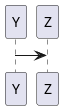

## Header

## Code block

```typescript
export function helloWorld() {
  console.log("Hello World!");
}
```

## Import Structurizr diagram

@structurizr(extension.dsl, DiagramKey)

## Import PlantUML diagram from file with one diagram

@plantuml(single.puml)

## Import Markdown file

@markdown(dir/markdown.md)

## Inline PlantUML diagram



## Valid link

[External Link](https://google.com)
[Internal Link](./dir/markdown.md)

## Invalid link

[Link](invalid-link.md)

## C# code

@code(HelloWorld.cs, csharp)

## Swagger

@swagger(petstore.json)
