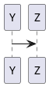

## Raw text

Lorem ipsum dolor sit amet, consectetur adipiscing elit. Aliquam et ultrices magna. Integer malesuada tellus vel turpis facilisis vulputate. Duis et elementum turpis. Suspendisse a venenatis nibh. Etiam ultrices felis interdum orci imperdiet congue. Ut at mi pharetra, faucibus erat sit amet, consequat ipsum. Pellentesque fringilla ut elit sed gravida. Nulla metus risus, pellentesque quis nunc id, venenatis maximus justo.

Praesent vitae libero at nunc malesuada fringilla ut at augue. Etiam bibendum congue sapien nec porttitor. Sed velit ex, vulputate sit amet rutrum nec, viverra ac tortor. Vivamus mauris lorem, scelerisque eget porta porta, fermentum sit amet eros. Vestibulum rutrum molestie purus, eu imperdiet odio venenatis in. Nam ex tortor, fermentum eget lobortis id, pellentesque eget elit. Fusce justo eros, faucibus quis semper ac, fermentum nec tellus. Vestibulum placerat elementum massa vitae volutpat. Donec aliquam, nisl ultricies lobortis consequat, libero ante rhoncus ligula, eget volutpat orci orci eget arcu.

## Import Structurizr diagram

@structurizr(extension.dsl, DiagramKey)

## Import PlantUML diagram from file with one diagram

@plantuml(single.puml)

## Import Markdown file

@markdown(markdown.md)

## Inline PlantUML diagram

## Valid link

[Link](https://www.onet.pl)

## Invalid link

[Link](invalid-link.md)

## C# code

@code(HelloWorld.cs, csharp)
